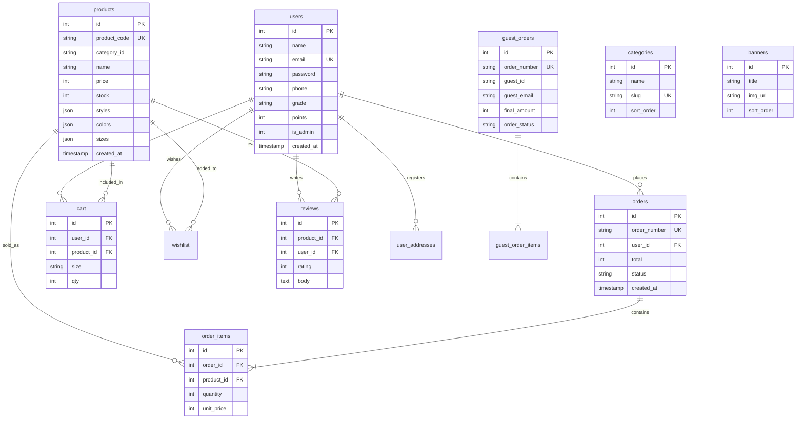

# VARO Shopping Mall - Entity Relationship Diagram
> 버전: v1.0.0

```mermaid
erDiagram
    users ||--o{ orders : "places"
    users ||--o{ cart : "adds_to"
    users ||--o{ wishlist : "wishes"
    users ||--o{ reviews : "writes"
    users ||--o{ user_addresses : "registers"
    
    products ||--o{ cart : "included_in"
    products ||--o{ order_items : "sold_as"
    products ||--o{ reviews : "evaluated_by"
    products ||--o{ wishlist : "added_to"
    
    orders ||--|{ order_items : "contains"
    
    guest_orders ||--|{ guest_order_items : "contains"
    
    users {
        int id PK
        string name
        string email UK
        string password
        string phone
        string grade
        int points
        int is_admin
        timestamp created_at
    }
    
    products {
        int id PK
        string product_code UK
        string category_id
        string name
        int price
        int stock
        json styles
        json colors
        json sizes
        timestamp created_at
    }
    
    orders {
        int id PK
        string order_number UK
        int user_id FK
        int total
        string status
        timestamp created_at
    }
    
    order_items {
        int id PK
        int order_id FK
        int product_id FK
        int quantity
        int unit_price
    }
    
    cart {
        int id PK
        int user_id FK
        int product_id FK
        string size
        int qty
    }
    
    reviews {
        int id PK
        int product_id FK
        int user_id FK
        int rating
        text body
    }

    guest_orders {
        int id PK
        string order_number UK
        string guest_id
        string guest_email
        int final_amount
        string order_status
    }

    categories {
        int id PK
        string name
        string slug UK
        int sort_order
    }
    
    banners {
        int id PK
        string title
        string img_url
        int sort_order
    }
```
