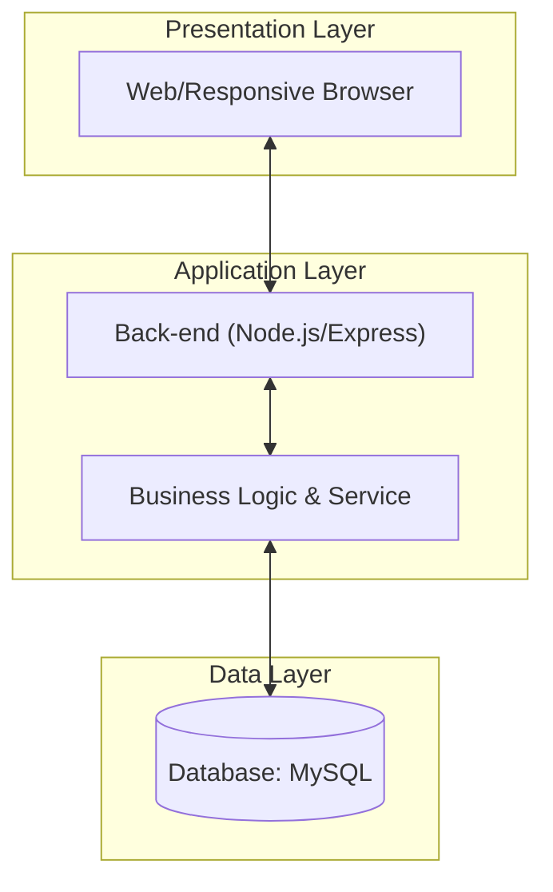

# [기술 보고서] VARO 쇼핑몰 시스템 설계 및 구현 요약

**버전:** v1.0.0
**본 문서는 제공된 7종의 기술 문서(Excel, PlantUML)를 바탕으로 핵심 내용을 집대성한 PPT 제작 및 PDF 제출용 통합 보고서입니다.**

---

## 1. 프로젝트 개요 (Project Overview)
*   **프로젝트명:** VARO Shopping Mall (고성능 데이터 연동 쇼핑몰)
*   **주요 목표:** 엑셀 기반 정적 데이터를 동적 대시보드로 시각화하고, 복잡한 비즈니스 로직(회원/비회원/어드민)을 체계적으로 구현.
*   **기술 스택:**
    *   **Backend:** Node.js, Express, Sequelize
    *   **Database:** MySQL (11개 엔티티)
    *   **Frontend:** Vanilla JS, CSS3, SVG Diagram System
    *   **Tooling:** ExcelJS, PlantUML, Mermaid.js
    *   **핵심 고도화:** 자동 회원 등급 갱신 시스템, 프로모션 코드 기반 쿠폰 엔진

---

## 2. 시스템 구성도 (System Architecture)
시스템은 확장성과 유지보수성을 고려한 **3-Tier Layered Architecture**로 설계되었습니다.

*   **Presentation:** 사용자 경험을 극대화한 라이트 모드 글래스모피즘 UI.
*   **Application:** JWT 기반 인증, 주문 처리 서비스, 실시간 매출 집계 엔진.
*   **Data:** 정규화된 11개 테이블 기반의 고정밀 데이터 관리.

---

## 3. 핵심 요구사항 (Functional Requirements)
총 12개의 핵심 기능 요구사항(FR-01 ~ FR-12)을 100% 충족하도록 설계되었습니다.

| ID | 요구사항 명칭 | 핵심 기술 및 내용 |
| :--- | :--- | :--- |
| **FR-01** | 소셜 로그인 | OAuth 2.0 기반 네이버/카카오/구글 연동 및 회원 가입 |
| **FR-05** | 비회원 주문 | 주문 비밀번호 해싱 처리 및 간편 조회 인터페이스 |
| **FR-06** | 카트 병합 | 로그인 시 세션 기반 장바구니를 DB로 자동 동기화 |
| **FR-09** | 어드민 배지 관리 | 상품별 NEW/HOT/SALE 속성 실시간 관리 및 시각화 |
| **FR-10** | 카테고리 트리 | 드래그 앤 드롭 방식의 카테고리 순서 조정 엔진 |
| **FR-11** | 쿠폰 고도화 | 프로모션 코드, 발급 수량 제어 및 리뷰 작성자 타겟팅 |

---

## 4. 유스케이스 분석 (Use Case Overview)
비회원, 회원, 관리자라는 3가지 액터의 권한과 기능을 명확히 구분하여 설계되었습니다.

*   **비회원 (Guest):** 상품 검색, 랭킹 조회, **비회원 전용 주문(비밀번호 기반)**.
*   **회원 (Member):** 계정 관리, 리뷰 및 별점 등록, **장바구니 하이브리드 동기화**.
*   **관리자 (Admin):** **전체 매출 통계 모니터링**, 상품 상태 및 배지 관리, 카테고리 정렬 조정.

---

## 5. 데이터베이스 설계 (ERD & Tables)
시스템 전반의 무결성을 보장하기 위한 11개 핵심 테이블 구조입니다.

### 핵심 테이블 리스트 (11)
1.  `users`: 회원 정보 및 권한 (grade, points)
2.  `products`: 상품 명세 및 배지 상태 (p_code, styles)
3.  `orders`: 주문 마스터 정보 (order_num, total_price)
4.  `order_items`: 주문 상세 내역 (qty, unit_price)
5.  `reviews`: 사용자 리뷰 및 별점 (u_id, p_id)
6.  `cart`: 장바구니 정보 (회원전용)
7.  `categories`: 트리형 분류 구조 (parent_id)
8.  `guest_orders`: 비회원 주문 전용 테이블
9.  `banners`: 메인 대시보드 배너 관리
10. `admin_logs`: 관리자 작업 이력 추적
11. `addresses`: 회원별 배송지 관리

---

## 6. PPT 제작을 위한 슬라이드 구성 가이드
1.  **Slide 1:** 표지 (프로젝트명, 발표자)
2.  **Slide 2:** 프로젝트 배경 및 목표
3.  **Slide 3:** 시스템 아키텍처 (구성도 이미지 포함)
4.  **Slide 4:** 주요 유스케이스 (졸라맨 액터 중심 UML)
5.  **Slide 5:** DB ERD (역할별 클러스터링 구조)
6.  **Slide 6:** 핵심 기능 구현 시연 (주문/관리 화면 캡처)
    *   [메인 페이지 캡처](file:///C:/Users/admin/.gemini/antigravity/brain/4a03f4f8-6871-461a-b141-aabe7433c25a/main_landing_page_banner_1777365781376.png)
    *   [상품 상세 캡처](file:///C:/Users/admin/.gemini/antigravity/brain/4a03f4f8-6871-461a-b141-aabe7433c25a/product_detail_page_1777365850826.png)
    *   [관리자 대시보드 캡처](file:///C:/Users/admin/.gemini/antigravity/brain/4a03f4f8-6871-461a-b141-aabe7433c25a/admin_dashboard_page_1777365859292.png)
7.  **Slide 7:** Q&A 및 마무리

---
**보고서 작성 완료:** 2026-04-28
**작성자:** Antigravity AI Assistant
